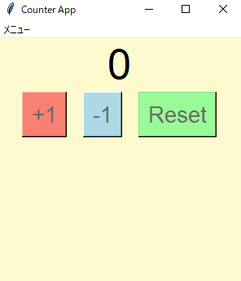

# Counterアプリ
## tkinterを使用したカウントアプリケーション
簡易カウント用アプリケーション
何か数を数える時にどうぞ

## 実行イメージ
### 実行画面

## できること
- 数字のカウント(+1,-1,リセット)

## 使用技術
- Python
- Tkinter

## 環境
- Python 3.10 以上
- Windows

## 起動及び使用手順
main.exeファイルの実行
もしくはコマンドプロンプト(対象ディレクトリ下)で以下コマンドを実行
python main.py

## フォルダ構成

フォルダ構成(折り畳み)  

counter_tkinter/  
├─build(build及びdistはexeファイル作成時に自動生成)  
├─dist  
│  └─main.exe  
├─docs  
│  └─01_count.png (実行時のスクリーンショット各種)  
├─logs(main_log.pyを実行した場合のみ、logを出力する)    
│  └─app.log  
├ main.py  
├ main_log.py(logファイルを出力するようにしているversion)  
└ icon_01.ico  
└ icon用.png  
└ README.md  

## 簡易設計

簡易設計(折り畳み)  

main.py  
	∟init(初期化)  
	∟create_main_frame(初期画面)	
	∟plus(加算)  
	∟minus(減算)  
	∟reset(リセット)  

# exe化方法(メモ)
■pyinstallerのインストール  
以下コマンドを実行  
pip install pyinstaller   

exe化の方法  
1.以下コマンドを実行  
pyinstaller main.py --onefile  --noconsole --icon=icon_01.ico

使用しそうなオプション  
--onefileは1つのファイルにまとめる  
--noconsoleはコンソールを表示しない  
--icon=test.icoはアイコンを変更(*.iconファイルを同一ディレクトリに配置する)  

2.作業ディレクトリ内にbuildディレクトリ/distディレクトリが作成される  
distディレクトリ内にあるmain.exeをダブルクリックで実行出来るようになっている(筈)  

3.エラーになった場合は  
コンソールからmain.exeを実行し、エラーを確認する(--noconsoleを設定していると出ない可能性あるので注意)  

# icon作成参考
https://qiita.com/Kosen-amai/items/4700100342c76f9fda78  
https://ao-system.net/alphaicon/  

## 備考
本ツールは個人開発アプリです。  

## 今後の改善
今の所予定はありません。  