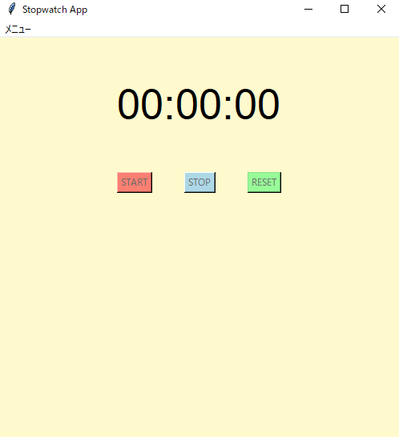

# Stopwatchアプリ
## tkinterを使用したストップウォッチ
簡易ストップウォッチ

## 実行イメージ
### 実行画面

## できること
- 1ミリ秒～59分間の経過時間を計測(任意でストップ可能)

## 使用技術
- Python
- Tkinter

## 環境
- Python 3.10 以上
- Windows

## 起動及び使用手順
main.exeファイルの実行
もしくはコマンドプロンプト(対象ディレクトリ下)で以下コマンドを実行
python main.py

## フォルダ構成

フォルダ構成(折り畳み)  

counter_tkinter/  
├─build(build及びdistはexeファイル作成時に自動生成)  
├─dist  
│  └─main.exe  
├─docs  
│  └─01_count.png (実行時のスクリーンショット各種)  
├ main.py  
└ icon_01.ico  
└ icon用.png  
└ README.md  

## 簡易設計

簡易設計(折り畳み)  

main.py  
	∟init(初期化)  
	∟create_main_frame(初期画面)	
	∟update_time(タイムの更新処理。afterによりstartを押した間10ミリ秒毎に更新を行う)  
	∟start(開始時間を取得し、update_timeを実行)  
	∟stop(今までの経過時間を取得し、after_cancelでupdate_timeの処理を止める)  
	∟reset(開始時間及び、経過時間を初期化)  
	∟toggle_buttons(start及びstopボタン押下時にボタンの有効化/無効化を切り替える)  

## 備考
本ツールは個人開発アプリです。  

## 今後の改善
今の所予定はありません。  