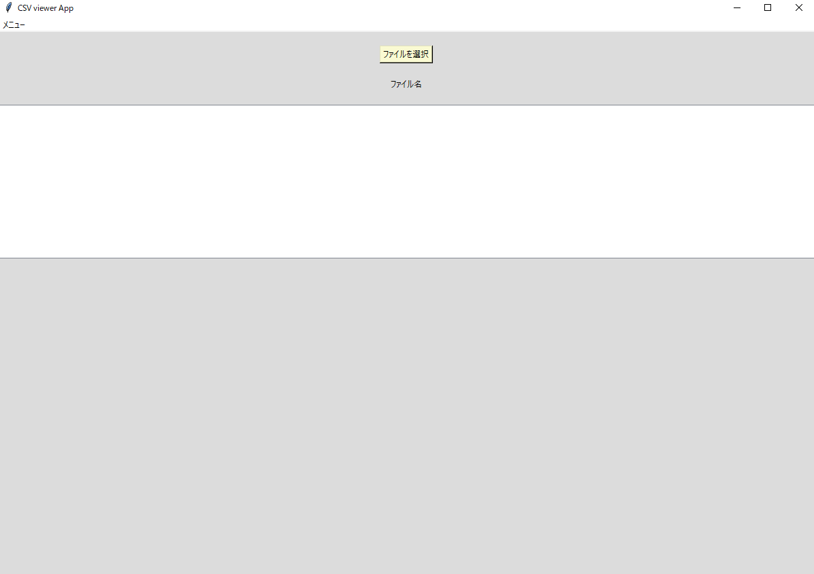
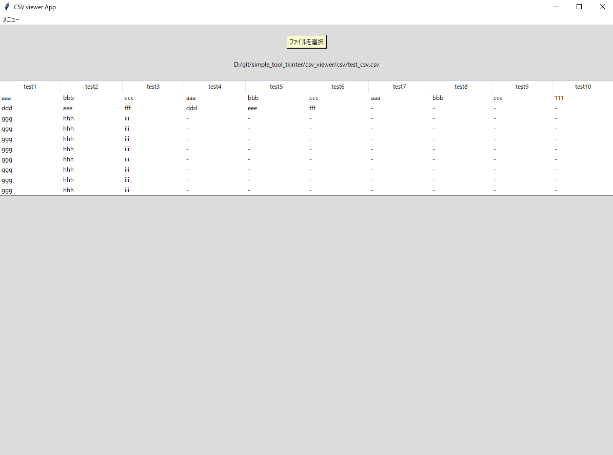
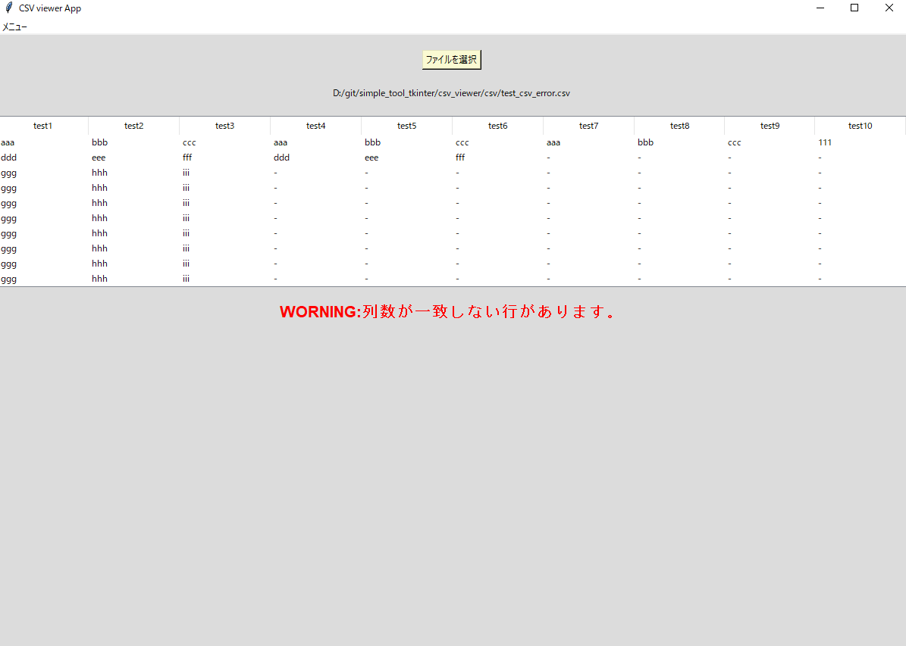

# CSVビューアアプリ
## tkinterを使用したCSVビューアアプリケーション
csvファイルのビューア用アプリです。
※csvファイルは見出し行と列が対応している前提です。

## 実行イメージ
### 実行画面

## できること
- csvファイルを開き、その内容を表示する(編集不可)  

## 使用技術
- Python
- Tkinter

## 環境
- Python 3.10 以上
- Windows

## 起動及び使用手順
main.exeファイルの実行  
もしくはコマンドプロンプト(対象ディレクトリ下)で以下コマンドを実行  
python main.py  

1. ファイルを選択ボタンを押す  
2. ファイルを選択  
3. 表で表示されます
※見出し列(カラム)に対して要素となる行が多い時、その多い行は表示されません。  

## フォルダ構成

フォルダ構成(折り畳み)  

csv_viewer/  
├─build(build及びdistはexeファイル作成時に自動生成)  
├─dist  
│  └─main.exe  
├─docs  
│  └─01_csv_viewer.png (実行時のスクリーンショット各種)  
│  └─  :  
│	 └─icon_01.clip(変換元ファイル)  
│  └─icon_01.png(icon変換用ファイル)  
├ main.py  
└ icon_01.ico  
└ README.md  

## 簡易設計

簡易設計(折り畳み)  

main.py  
	∟init(初期化)  
	∟create_main_frame(初期画面)	
	∟import_file(csvファイルの読み込み/表示処理)  

## 備考
本ツールは個人開発アプリです。  

## 今後の改善
特になし  