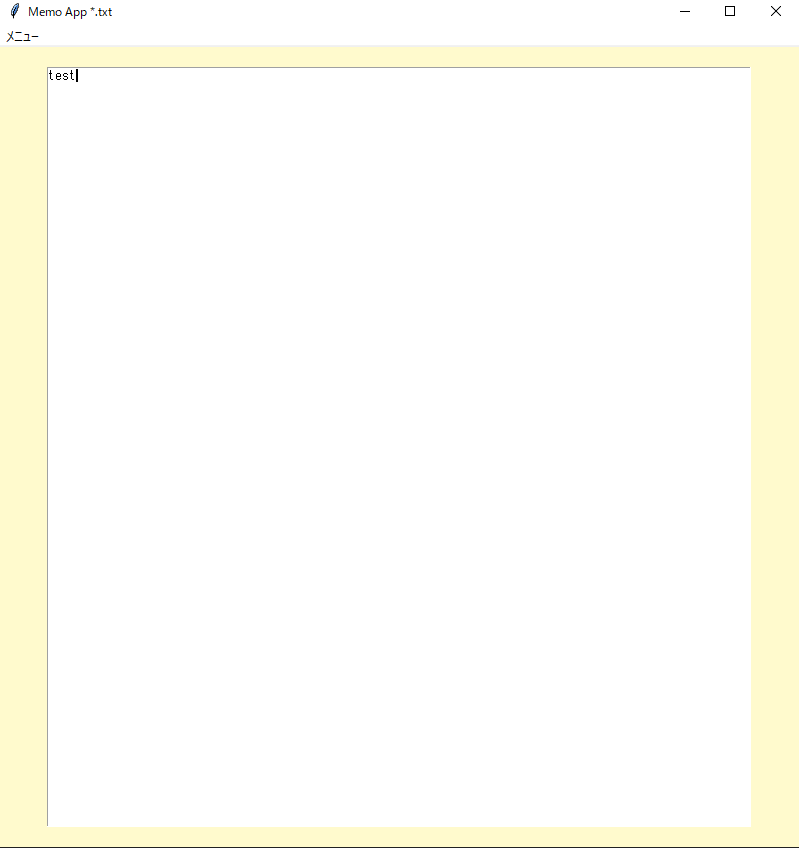

# memoアプリ
## tkinterを使用したメモ帳ツール
簡易メモ帳ツール      

## 実行イメージ
### 実行画面

.png)

## できること
- テキストエリアへの書き込み  
- 名前を付けて保存、ファイルを開く、上書き保存  

## 使用技術
- Python
- Tkinter

## 環境
- Python 3.10 以上
- Windows

## 起動及び使用手順
main.exeファイルの実行
もしくはコマンドプロンプト(対象ディレクトリ下)で以下コマンドを実行
python main.py

## フォルダ構成

フォルダ構成(折り畳み)  

memo/  
├─build(build及びdistはexeファイル作成時に自動生成)  
├─dist  
│  └─main.exe  
├─docs  
│  └01_memo.png (実行時のスクリーンショット各種)  
│  └02_ ...  
│  └icon_01.clip(変換前iconファイル)  
│  └icon_01.png(同上)  
├ main.py  
└ icon_01.ico  
└ README.md  

## 簡易設計

簡易設計(折り畳み)  

main.py  
	∟init(初期化)  
	∟create_main_frame(初期画面)  
	∟save_file(名前を付けて保存)  
	∟update_file(上書き保存)  
	∟import_file(ファイルを開く)  

## 備考
本ツールは個人開発アプリです。  

## 今後の改善
今の所予定はありません。  