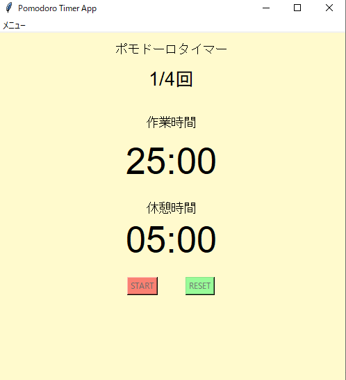

# Timerアプリ
## tkinterを使用したポモドーロタイマーアプリケーション
25分作業 + 5分休憩を繰り返すシンプルなポモドーロタイマーです。

## 実行イメージ
### 実行画面

## できること
- 作業 / 休憩の自動切り替え  
- ポモドーロ回数表示  
- スタート / リセット  
- 終了時に通知音  

## 使用技術
- Python
- Tkinter

## 環境
- Python 3.10 以上
- Windows

## 起動及び使用手順
main.exeファイルの実行  
もしくはコマンドプロンプト(対象ディレクトリ下)で以下コマンドを実行  
python main.py  

1. startボタンを押す  
2. 作業開始  
3. 自動で休憩に切り替わります  

## フォルダ構成

フォルダ構成(折り畳み)  

counter_tkinter/  
├─build(build及びdistはexeファイル作成時に自動生成)  
├─dist  
│  └─main.exe  
├─docs  
│  └─01_pomodoro.png (実行時のスクリーンショット各種)  
│	 └─icon_01.ico  
│  └─icon用.png  
├ main.py  
└ README.md  

## 簡易設計

簡易設計(折り畳み)  

main.py  
	∟init(初期化)  
	∟create_main_frame(初期画面)	
	∟start(スタート)  
	∟reset(リセット)  
	∟update_display(画面更新処理)  
	∟tick(作業中/休憩判定及び切り替え処理)  
	∟toggle_buttons(スタート/リセットボタンの有効化/無効化処理)  

## 備考
本ツールは個人開発アプリです。  

## 今後の改善
今の所予定はありません。  